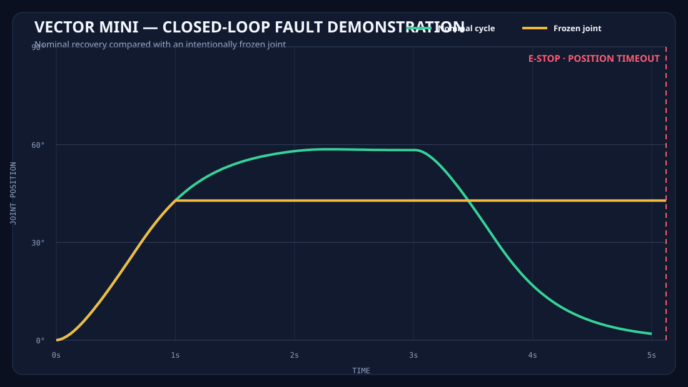
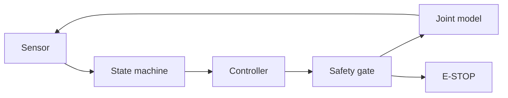

# VECTOR Mini

**A safety-first, closed-loop motion-controller testbed for wearable robotics.**

[](https://www.python.org/)
[](#verification)
[](LICENSE)

VECTOR Mini demonstrates how a wearable robotic joint can interpret a movement request, regulate position, monitor its own health, and fail safely. Version 0.1 runs entirely in Python, so the control architecture and fault handling can be tested before energizing physical hardware.



## Why this project exists

Wearable robotics is not just a motor-control problem. Any controller operating near a person needs bounded outputs, deterministic states, fresh sensor data, independent safety checks, and predictable recovery behavior. VECTOR Mini makes those engineering decisions visible and testable.

## System flow



Nominal motion follows:

`IDLE → ARMING → FLEX → HOLD → EXTEND → RESET → IDLE`

Every operating state can transition immediately to a latched `E_STOP`.

## Quick start

No third-party runtime packages are required.

```bash
git clone https://github.com/JJaskolkaTech/VECTOR-Mini.git
cd VECTOR-Mini
make test
make demo
make fault-demo
```

Or run directly:

```bash
PYTHONPATH=src python3 -m vector_mini.cli --scenario timeout --fast
```

The fault demo freezes the simulated joint during flexion. After five seconds without completing the movement, the safety gate latches `POSITION_TIMEOUT`, switches the state to `E_STOP`, and forces the actuator request to zero.

```text
Controller State:  E_STOP
Motor Command:       0.0%
Safety Gate:       LOCKED
Fault:             POSITION_TIMEOUT
```

## Engineering features

- 50 Hz software-in-the-loop simulation
- Deterministic finite-state motion control
- Bounded proportional-derivative controller
- Joint position and velocity feedback
- Independent actuator safety gate
- Sensor watchdog and validity checks
- Position, velocity, and movement-time limits
- Latched E-stop with safe-posture manual reset
- Repeatable nominal, timeout, and watchdog scenarios
- CSV telemetry export
- Standard-library automated test suite
- Teensy 4.0 firmware scaffold for v0.2

## Verification

```bash
make verify
```

This runs all unit and integration tests, then generates nominal and fault telemetry under `demo_output/`.

See [the safety model](docs/safety-model.md), [architecture notes](docs/architecture.md), and [verification plan](docs/test-plan.md) for the engineering rationale.

## Roadmap

- **v0.1 — Software-in-the-loop:** Python controller, joint simulation, fault injection, tests
- **v0.2 — Hardware-in-the-loop:** deterministic control on Teensy 4.0; Python telemetry console
- **v0.3 — Bench mechanism:** potentiometer/encoder feedback, current-limited servo or tendon actuator
- **v0.4 — Biosignal input:** filtered EMG intent enters through a confidence gate, never directly into actuator authority

## Safety and project boundary

VECTOR Mini is an independent educational testbed inspired by general wearable-robotics problems. It is not a medical device, safety-certified controller, or repository of proprietary KINETIC production code. Do not attach an actuator to a person using this software.

## Author

Josh Jaskolka — Jaskolka Industries  
[LinkedIn](https://lnkd.in/p/gAFFh-fB)
