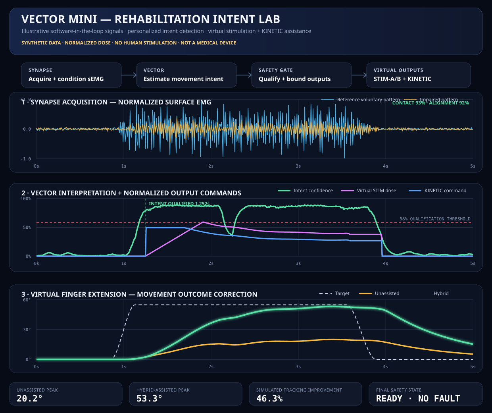
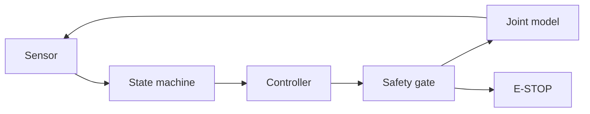

# VECTOR Mini

**A safety-first, closed-loop motion-controller testbed for wearable robotics.**

[](https://www.python.org/)
[](#verification)
[](LICENSE)

VECTOR Mini demonstrates how a wearable robotic joint can interpret a movement request, regulate position, monitor its own health, and fail safely. Version 0.1.1 also introduces a synthetic rehabilitation-intent lab: SYNAPSE-style sEMG acquisition feeds VECTOR intent estimation, then an independent safety gate qualifies normalized virtual-stimulation and KINETIC-assistance outputs. Everything runs in Python before any physical hardware is energized.




## Why this project exists

Wearable robotics is not just a motor-control problem. Any controller operating near a person needs bounded outputs, deterministic states, fresh sensor data, independent safety checks, and predictable recovery behavior. VECTOR Mini makes those engineering decisions visible and testable.

## System flow



Nominal motion follows:

`IDLE → ARMING → FLEX → HOLD → EXTEND → RESET → IDLE`

Every operating state can transition immediately to a latched `E_STOP`.

## Quick start

No third-party runtime packages are required.

```bash
git clone https://github.com/JJaskolkaTech/VECTOR-Mini.git
cd VECTOR-Mini
make test
make demo
make fault-demo
make rehab-demo
make rehab-fault-demo
```

Or run directly:

```bash
PYTHONPATH=src python3 -m vector_mini.cli --scenario timeout --fast
```

The fault demo freezes the simulated joint during flexion. After five seconds without completing the movement, the safety gate latches `POSITION_TIMEOUT`, switches the state to `E_STOP`, and forces the actuator request to zero.

```text
Controller State:  E_STOP
Motor Command:       0.0%
Safety Gate:       LOCKED
Fault:             POSITION_TIMEOUT
```

## Rehabilitation Intent Lab

`make rehab-demo` generates deterministic, synthetic telemetry for the proposed research loop:

`movement attempt → SYNAPSE sEMG → VECTOR intent estimate → safety gate → virtual NMES/FES + KINETIC assistance → finger motion`

The demo compares an illustrative reference sEMG pattern with a weaker, delayed, variable pattern. VECTOR uses a personalized calibration, RMS envelope, trend evidence, dwell time, and hysteresis to qualify movement intent. A virtual electrode layer checks normalized contact and placement scores; a dose controller ramps and bounds a unitless stimulation request; a separate bounded KINETIC command contributes mechanical assistance.

The default simulated finger reaches **20.15° unassisted** and **53.31° with hybrid assistance**, with a **46.3% reduction in tracking RMSE**. These are software-model results, not predicted patient outcomes.

`make rehab-fault-demo` injects virtual electrode-contact loss. The gate latches `ELECTRODE_CONTACT` and immediately forces both stimulation and KINETIC commands to zero.

Important distinction: sEMG senses electrical activity associated with muscle activation; it does not record the brain directly and does not stimulate tissue. The virtual NMES/FES channel is a separate, safety-gated output. See the [Rehabilitation Intent Lab design note](docs/rehabilitation-intent-lab.md) for terminology, evidence, limitations, and the responsible path toward benchtop and clinical research.

## Engineering features

- 50 Hz software-in-the-loop simulation
- Deterministic finite-state motion control
- Bounded proportional-derivative controller
- Joint position and velocity feedback
- Independent actuator safety gate
- Sensor watchdog and validity checks
- Position, velocity, and movement-time limits
- Latched E-stop with safe-posture manual reset
- Repeatable nominal, timeout, and watchdog scenarios
- Synthetic reference and impaired-pattern sEMG acquisition
- Personalized RMS-envelope and trend-based intent estimation
- Virtual electrode contact and placement qualification
- Normalized dose ramp, exposure timeout, and dual-output safety gate
- Hybrid virtual NMES/FES and KINETIC finger-motion simulation
- Contact-loss, placement, signal, and E-stop fault injection
- CSV telemetry export
- Standard-library automated test suite
- Teensy 4.0 firmware scaffold for v0.2

## Verification

```bash
make verify
```

This runs all 24 unit and integration tests, then generates motion-control, fault-injection, and rehabilitation-intent telemetry under `demo_output/` and refreshes both SVG demonstrations.

See [the safety model](docs/safety-model.md), [architecture notes](docs/architecture.md), [rehabilitation-intent design note](docs/rehabilitation-intent-lab.md), and [verification plan](docs/test-plan.md) for the engineering rationale.

## Roadmap

- **v0.1 — Software-in-the-loop:** Python controller, joint simulation, fault injection, tests
- **v0.1.1 — Rehabilitation intent lab:** synthetic sEMG, personalized intent confidence, abstract electrode checks, normalized virtual stimulation, hybrid assistance
- **v0.2 — Hardware-in-the-loop:** deterministic control on Teensy 4.0; Python telemetry console
- **v0.3 — Instrumented bench:** electrode/skin phantom, electrical load measurement, potentiometer/encoder feedback, and a current-limited actuator
- **v0.4 — Validated biosignal interface:** real sEMG through qualified acquisition hardware and a clinician/regulatory research partnership before any human stimulation

## Safety and project boundary

VECTOR Mini is an independent educational testbed inspired by general wearable-robotics problems. It is not a medical device, therapy, safety-certified controller, human-use stimulation protocol, or repository of proprietary KINETIC production code. It contains no anatomical electrode-placement coordinates and no electrical current, pulse-width, frequency, or voltage prescription. Do not connect this software to electrodes, a stimulator, an actuator, or a person.

## Author

Josh Jaskolka — Jaskolka Industries  
[LinkedIn](https://lnkd.in/p/gAFFh-fB)
