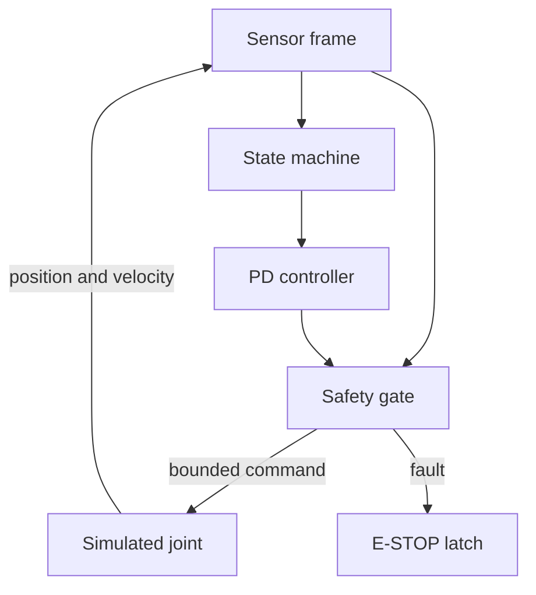

# Architecture

VECTOR Mini separates motion intent from actuator authority. The state machine may request motion, but only the independent safety gate can authorize a nonzero motor command.

## Control loop

The software-in-the-loop model executes at 50 Hz. Each cycle:

1. Samples position and velocity.
2. Checks timestamp freshness, numeric validity, position, velocity, and movement duration.
3. Calculates a bounded PD control request.
4. Forces output to zero if any fault has latched.
5. Advances the simulated joint and records telemetry.

The architecture deliberately keeps the safety gate outside the controller. A controller bug therefore does not automatically become actuator authority.

