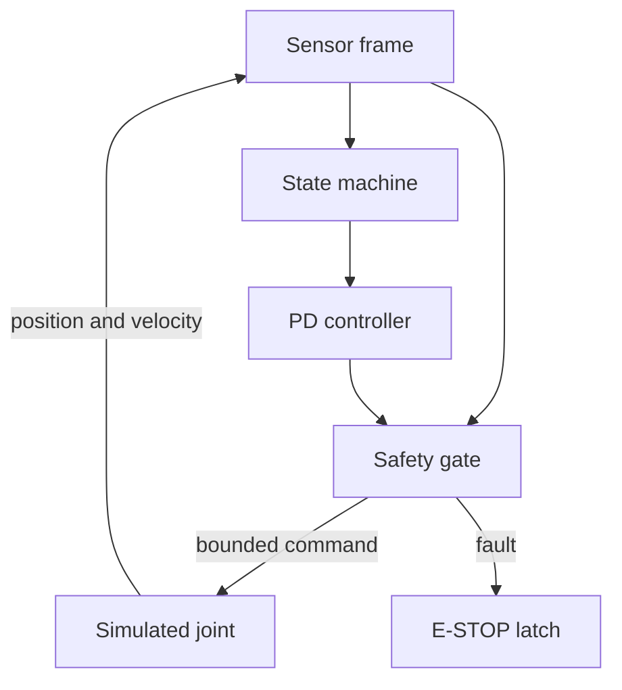

# Architecture

VECTOR Mini separates motion intent from actuator authority. The state machine may request motion, but only the independent safety gate can authorize a nonzero motor command.

## Control loop

The software-in-the-loop model executes at 50 Hz. Each cycle:

1. Samples position and velocity.
2. Checks timestamp freshness, numeric validity, position, velocity, and movement duration.
3. Calculates a bounded PD control request.
4. Forces output to zero if any fault has latched.
5. Advances the simulated joint and records telemetry.

The architecture deliberately keeps the safety gate outside the controller. A controller bug therefore does not automatically become actuator authority.

## Rehabilitation-intent research loop

The v0.1.1 simulation preserves explicit subsystem ownership:

| Subsystem | Responsibility |
| --- | --- |
| SYNAPSE | Acquire and condition a target-muscle sEMG observation; report signal and virtual-electrode quality |
| VECTOR | Compare the observation with a personal calibration, estimate intent confidence, and calculate a correction request |
| Safety gate | Independently qualify confidence, contact, placement, duration, and E-stop state; bound or zero every output |
| Virtual NMES/FES | Model a normalized stimulation contribution without hardware or clinical parameters |
| KINETIC | Model a separate bounded mechanical-assistance contribution |
| Finger model | Convert voluntary and assisted drive into observable position feedback |

Neither SYNAPSE sensing nor VECTOR interpretation directly owns actuator authority. The two output channels share a fail-closed gate, but remain separately observable in telemetry.

The model intentionally evaluates correction at the movement layer. It never rewrites the impaired sEMG trace to resemble the reference trace and therefore does not imply that the biological signal or a damaged nerve has been repaired.
