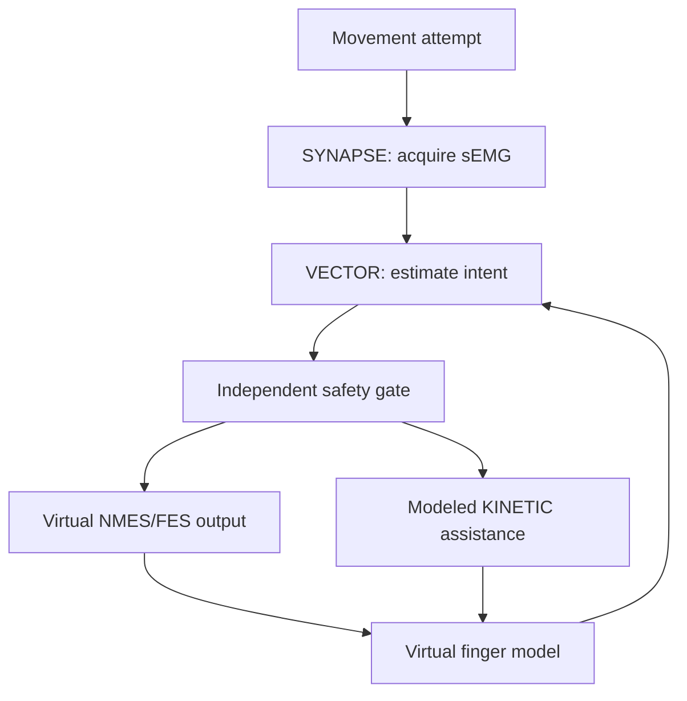

# Rehabilitation Intent Lab

## Evidence demonstrated

This software-in-the-loop experiment demonstrates the proposed information path from a weak voluntary muscle-activation pattern to qualified assistance:

The current evidence stage is executable software-in-the-loop verification: every waveform is synthetic, every output is normalized, the finger response is virtual, and the complete path is exercised by deterministic fault injection and automated tests. Clinical efficacy, biological recovery, and human stimulation are later validation questions that require instrumented and appropriately supervised research.

## Precise terminology

| Layer | What it represents | Boundary of current evidence |
| --- | --- | --- |
| Voluntary command | A modeled attempt to extend a finger | A direct brain recording |
| Surface EMG | Electrical activity detected over an active muscle at the skin | A command sent by an sEMG electrode |
| VECTOR intent confidence | Software evidence that the calibrated pattern reflects intended movement | A diagnosis or certainty about a person's intent |
| Virtual stimulation command | A bounded, normalized request to a mock NMES/FES channel | Current, voltage, pulse width, frequency, or a clinical dose |
| KINETIC command | A bounded request to the modeled mechanical-assistance channel | A command to physical exoskeleton hardware |
| Corrected trajectory | Improved movement of the virtual finger | A repaired biological waveform or proven neural recovery |

sEMG is the sensing side of the loop. NMES/FES is a distinct output side. The two may eventually be coupled only through VECTOR's interpretation and an independent safety system.

## Signal model

The deterministic scenario generates two illustrative normalized sensor-voltage traces:

- A **reference voluntary pattern** with a strong, sustained recruitment envelope.
- An **impaired-pattern attempt** with lower amplitude, delayed recruitment, variability, fatigue, and a short dropout.

The reduced-recruitment pattern is a synthetic example rather than a universal model of paralysis, stroke, spinal-cord injury, or chronic pain. Some people and conditions may provide usable residual sEMG; others may not. Real control would require individual calibration, validated acquisition hardware, signal-quality monitoring, and a fallback intent source when residual sEMG is inadequate.

VECTOR calculates a trailing RMS envelope, normalizes it against a modeled personal calibration, combines activation level with positive trend evidence, smooths the result, and requires an 80 ms qualification dwell before declaring intent. Hysteresis prevents threshold chatter.

## Virtual electrodes and dose

Electrodes and dose are intentionally visible in the demo because they are central to the SYNAPSE research hypothesis. They remain abstract so the repository cannot be mistaken for a human-use protocol.

| Modeled control | Nominal behavior |
| --- | --- |
| `SENSE-A` | Abstract target-muscle sEMG channel |
| `STIM-A/B` | Abstract virtual target-muscle stimulation pair |
| Contact quality | Both channel contacts must exceed the configured unitless threshold |
| Placement alignment | The abstract alignment score must exceed the configured unitless threshold |
| Dose request | Closed-loop correction request in the range 0–1 |
| Delivered stimulation | Bounded 0–1 output with a software ramp limiter |
| Exposure limit | Continuous assistance has a hard timeout |
| KINETIC output | Separately bounded mechanical-assistance request |

There are no anatomical placement coordinates and no electrical dose parameters in this repository.

## Fail-closed behavior

The same intent decision can request virtual stimulation and KINETIC motion, but neither has actuator authority by itself. The safety gate forces both outputs to zero and latches `E_STOP` for:

- invalid or non-finite signal data;
- inadequate virtual electrode contact;
- invalid virtual placement alignment;
- excessive continuous-assistance duration; or
- an external E-stop.

A drop in confidence normally returns the system to `READY` and immediately de-energizes both virtual channels.

## Deterministic nominal result

With the repository's fixed seed and default configuration:

| Metric | Result |
| --- | ---: |
| Intent qualification | 1.252 s |
| Peak intent confidence | 89.6% |
| Reduced-recruitment envelope peak | 45% of reference |
| Unassisted peak extension | 20.15° |
| Hybrid-assisted peak extension | 53.31° |
| Modeled tracking-error reduction | 46.3% |
| Final safety result | `READY`, no fault |

These are generated properties of the software model, not predicted clinical outcomes.

## Validation path from model to human research

The present release establishes the software behavior. Progression toward human research requires the following evidence:

1. Verify waveform timing, isolation assumptions, fault behavior, and energy cutoffs against an electrode/skin phantom and instrumented electrical load.
2. Interface only through an appropriate, independently validated or legally marketed stimulation system; do not turn this repository into a custom human stimulator.
3. Develop a formal risk analysis, hardware interlocks, clinician-owned placement and dose protocol, contraindication screening, adverse-event response, and verification evidence.
4. Conduct any human research only with qualified clinical and regulatory collaborators, ethics/IRB review where required, informed consent, and appropriate oversight.

## Research context

- Surface EMG has potential in neurorehabilitation, but acquisition, interpretation, standardization, and clinical-use barriers matter: [Campanini et al., 2020](https://pubmed.ncbi.nlm.nih.gov/32982942/).
- A small randomized pilot used residual myoelectric activity to control FES for selected post-stroke participants; the authors explicitly called for larger studies: [Thorsen et al., 2013](https://pubmed.ncbi.nlm.nih.gov/24203541/).
- Myoelectrically controlled FES has also been studied as an assistive tenodesis-grip interface in people with cervical spinal-cord lesions: [Thorsen et al., 2020](https://doi.org/10.3389/fnins.2020.00412).
- In the United States, a powered muscle stimulator intended for medical purposes is a regulated Class II device: [21 CFR 890.5850](https://www.ecfr.gov/current/title-21/chapter-I/subchapter-H/part-890/subpart-F/section-890.5850).

These references establish research precedent and regulatory context. VECTOR Mini's present evidence comes from software verification; rehabilitation and clinical claims would require their own appropriately designed studies.
